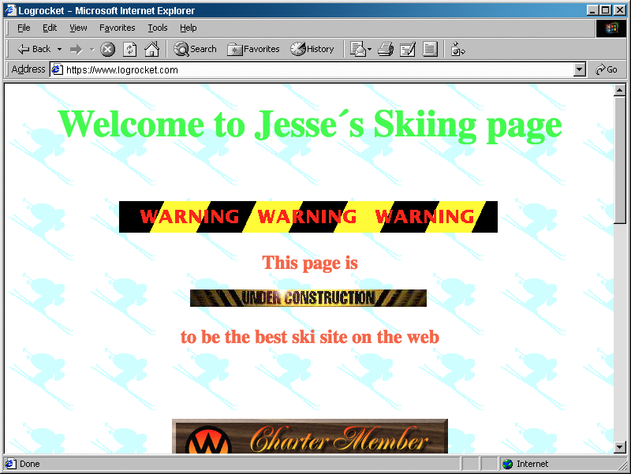
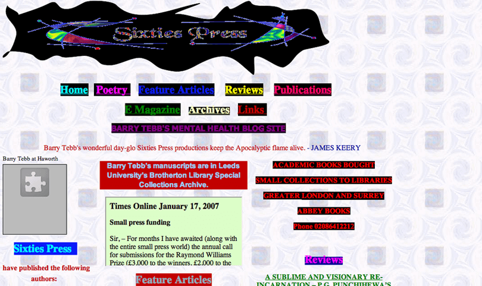
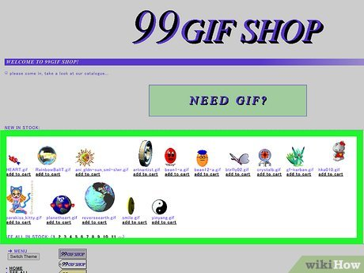

# Not what you can think of

Description of the project (one or two sentences which introduce your project).

A website that you will not know how it is going to turn out.

# Theme  

Explain topic or ideas are you exploring through a subverted/expanded 
interface paradigm. Highlight any references or sources of inspiration. 

Defamiliarisation
We have been relying on tools and shortcuts to easily access interfaces. 
Already the muscle memory embeded whenever we interact with an interface.
How we know we can use the mouse to direct ourselves through a website, using the keyboard to input information, copying and pasting using CTRL+C and CTRL+V.
Going to explore how we can change the norm of interacting an interface.

Power and Control
Website designers always have the power to lead you to do what they want you to.
For example, they would emphasise the 'BUY NOW' button so that you'll unconsiously willing to press on the highlighted button.
Now that I can code and control what the users are able to access and use, I want to mess up what the users would normally do or to make the website not make sense.

Inspirations

# Mechanics  

Explanation of the how users experience or interact with your project.

There will be a simple website, where users are able to interact with it.
There will be a few tasks or levels where you have to complete under the difficult circumstances they are in.
This could be working with an inverted mouse, keyboard keys are messed up, cursor constantly changing positions.

# Aims  

Any objectives, goals, or idea you want the user or viewer to enage with. 

Main objective is to make the user uncomfortable when dealing with the website.
To feel like using an interface is foreign and difficult.
Knowing that we are so used to what we are using, and question why are interfaces build the 'normal' way that we all use.
Remembering how we felt when we first accessed technology and interfaces where we had to adjust the way we think or move 

# Aesthetics

What will it look like? Include an example of the style.

It would look very 1990s, old webpage designs.
Very old school vibes, bright colours that doesn't go well together.

# Technology 

Explain how you will you make your prototype, such as using p5.js, 
slideshow, commandline, physical interface, spreadsheet, 
video, desktop documentary, slideshow, other, or a combination of this list. 

# Group  
If a group project, clearly define everyone’s role/duties, 
and provide greater detail of your own role. 

# Wireframes 

# Random Ideas

Which came first? Video Editing or Electronic Presentation.

Unfamiliarise ourselves with the software we are used to and using it the way it was meant to be. By exploring other means of doing it, we may realise some of the functions that we never explored or used.

social/political relations, how it affected how things are produced or turn out

how it is mediating 

reworking and denormalising

exploring the notion between something and technology

theme of control, power, 